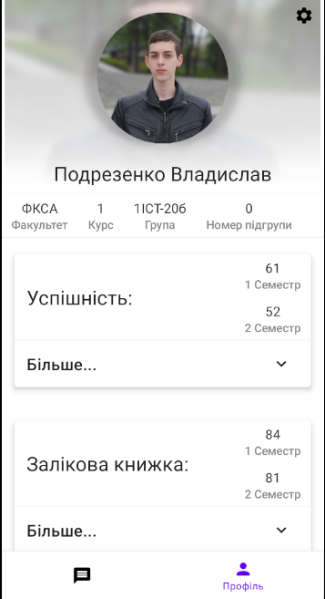
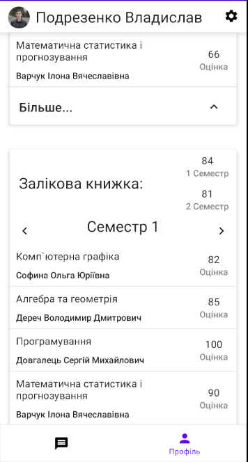
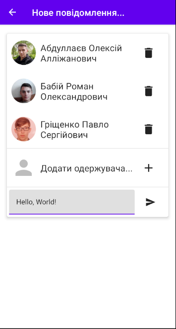

# JetIQ

The aim of this app to provide stable and modern-looking application of JetIQ for students of VNTU.

## The Android development and architecture

* The entire codebase is in [Kotlin](https://kotlinlang.org/)
* Uses Kotlin [Coroutines](https://kotlinlang.org/docs/reference/coroutines/coroutines-guide.html).
* Uses Android MVVM Architecture
  by [AAC](https://developer.android.com/topic/libraries/architecture/).
* Uses [Jetpack Compose](https://developer.android.com/jetpack/compose) as UI Toolkit.
* Uses [Room](https://developer.android.com/training/data-storage/room)
  and [Flow](https://kotlinlang.org/docs/flow.html) to store and load data with reactive way.
* Uses [Hilt](https://developer.android.com/training/dependency-injection/hilt-android) for
  dependency injection.
* Unit testing with [JUnit 4](https://junit.org/junit4/) and [MockK](https://mockk.io).
* Uses [StateFlow](https://kotlin.github.io/kotlinx.coroutines/kotlinx-coroutines-core/kotlinx.coroutines.flow/-state-flow/) to process events.

## Screenshots

### Profile

### Messages

### New Message

### Contacts

### Settings

## Installation

Minimum required android version: Android 6.0

To install download apk from releases.

## Contributions

To raise an feature or notify contributors about bug please use a github issues. To modify or fix
something fork repository and do pull request.
